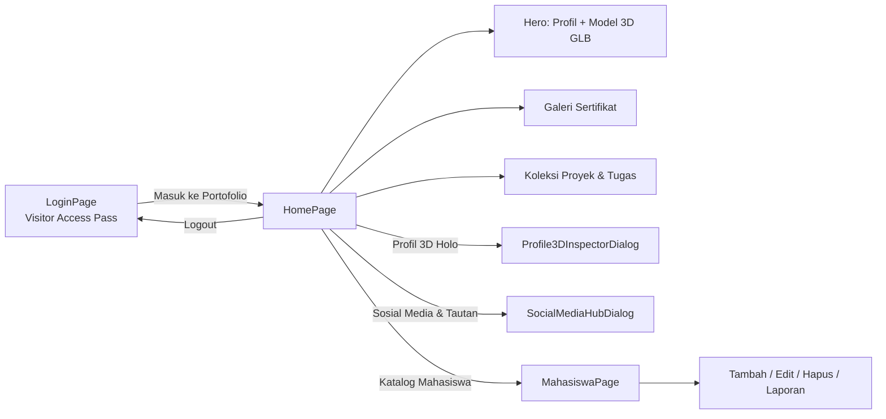
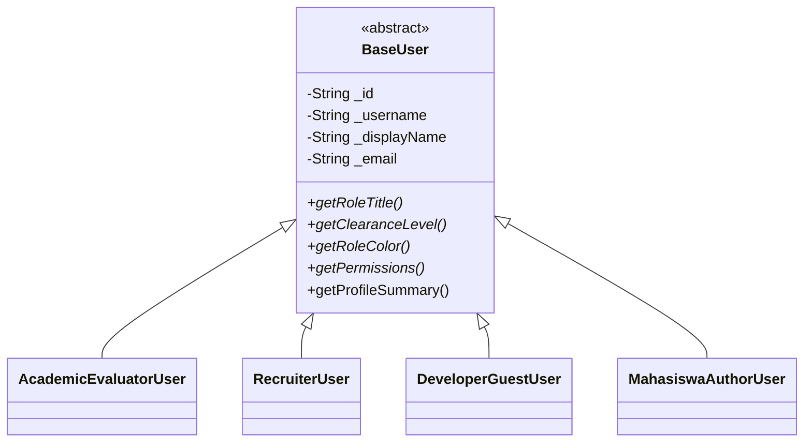
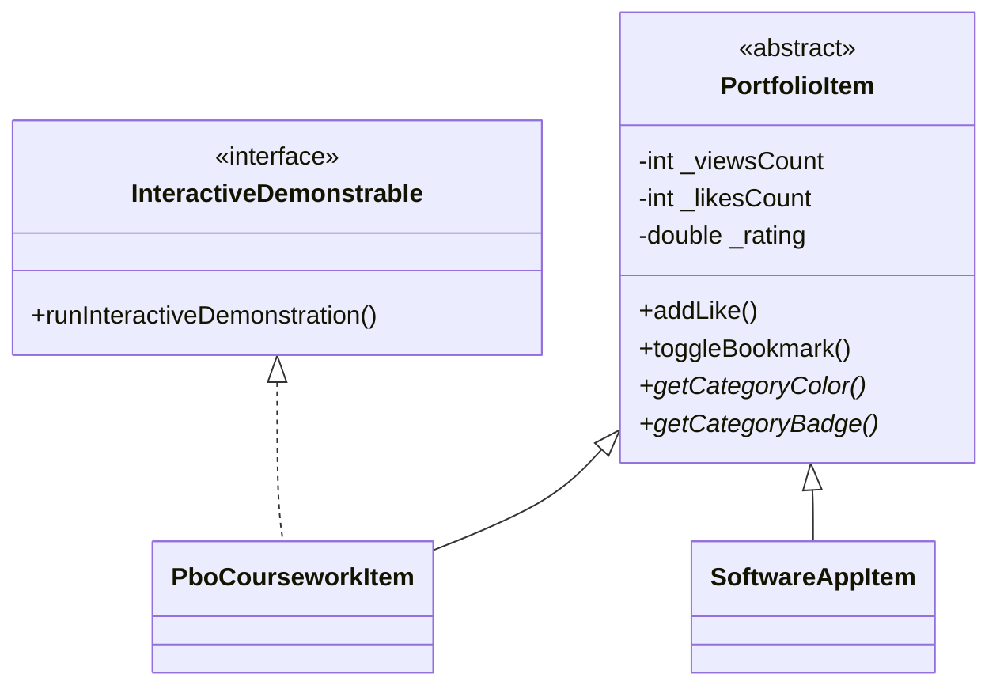

<div align="center">

# 🌌 Portofolio Digital

**Aplikasi portofolio mahasiswa berbasis Flutter Web dengan tema _Minimalis Elegan_ (dark mode),
animasi kosmik, model 3D interaktif**


</div>

---

## 📑 Daftar Isi

- [Gambaran Umum](#-gambaran-umum)
- [Alur Aplikasi](#-alur-aplikasi)
- [Tampilan & Output Setiap Halaman](#-tampilan--output-setiap-halaman)
- [Implementasi Konsep PBO](#-implementasi-konsep-pbo)
- [Struktur Direktori](#-struktur-direktori)
- [Teknologi & Dependensi](#-teknologi--dependensi)
- [Cara Menjalankan](#-cara-menjalankan)
- [Kontak](#-kontak)

---

## 🔭 Gambaran Umum

| Item | Keterangan |
| --- | --- |
| **Nama App** | Portofolio Digital & Laboratorium PBO |
| **Pemilik** | Wishang — Informatics Engineer |
| **Halaman awal** | `LoginPage` (Visitor Access Pass) |
| **Tema** | Dark mode — Obsidian, Indigo neon, Cyan glow, Emerald |
| **Font** | Plus Jakarta Sans & Outfit (Google Fonts) |
| **Responsif** | Layout desktop (lebar > 900/960 px) & mobile |

### ✨ Fitur Utama

- 🔐 **Login kreatif** bergaya _Cyber Gateway_ dengan simulasi verifikasi bertahap.
- 🧑‍🚀 **Foto profil lingkaran 3D** dengan tilt mengikuti kursor, ring gradasi berputar, dan satelit orbit.
- 🤖 **Model 3D `.glb` asli** (robot) yang bisa diputar 360° dan punya 4 animasi.
- 🌐 **Dialog Profil 3D Holo**: skin avatar, slider rotasi, efek scanline, dan cincin giroskop.
- 🏅 **Galeri sertifikat** dengan filter kategori dan _lightbox_.
- 📂 **Katalog proyek** memakai `ListView.builder` dengan filter kategori.
- 🎓 **Katalog mahasiswa (CRUD)**: tambah, edit (melalui _setter_), hapus, cari, dan laporan akademik.
- 🌠 **Latar animasi** `CustomPainter`: partikel konstelasi, aurora orbs, dan grid.

---

## 🧭 Alur Aplikasi



---

## 🖥️ Tampilan & Output Setiap Halaman

### 1️⃣ Halaman Login — `Visitor Access Pass`

📄 [`lib/pages/login_page.dart`](lib/pages/login_page.dart) · [`lib/widgets/cyber_login_card.dart`](lib/widgets/cyber_login_card.dart)

| Bagian | Output yang Tampil |
| --- | --- |
| **Kolom kiri (branding)** | Avatar lingkaran, badge `PORTFOLIO ACCESS GATEWAY`, nama **Wishang**, subjudul _Informatics Engineer_, headline **"Arsitektur Kode Bersih & Portofolio Interaktif."** |
| **Kolom kanan (kartu login)** | Kartu _glassmorphism_ berdenyut, badge `GATEWAY VERIFIED`, judul **Visitor Access Pass** |
| **Form** | Input **NIM** dan **Password** (bisa disembunyikan/ditampilkan) beserta validasi |
| **Status login** | Pesan bertahap: _Menginisialisasi Protokol Gateway..._ → _Memverifikasi NIM Mahasiswa..._ → _Izin Terverifikasi..._ |

> **🔑 Akun Demo** (sudah terisi otomatis)
>
> | NIM | Password |
> | --- | --- |
> | `2026-PBO-001` | `pbo_flutter2026` |
>
> Validasi: NIM minimal **3 karakter**, password minimal **4 karakter**.

---

### 2️⃣ Halaman Home

📄 [`lib/pages/home_page.dart`](lib/pages/home_page.dart)

**Navbar** ([`nav_bar.dart`](lib/widgets/nav_bar.dart)) — _glassmorphism_ dengan menu **Tentang · Sertifikat · Proyek & Tugas · Profil 3D Holo · Katalog Mahasiswa**, plus tombol **Logout** (dengan dialog konfirmasi).

#### 🅰️ Hero / Tentang

- **Foto profil 3D** ([`circular_profile_avatar.dart`](lib/widgets/circular_profile_avatar.dart)): tilt perspektif 3D, ring gradasi berputar, efek melayang (_idle float_), dan satelit orbit.
- **Teks mengetik** ([`typewriter_text.dart`](lib/widgets/typewriter_text.dart)): `Halo, Saya` → _Wishang 👋_ / _Flutter Developer 🚀_ / _Software Architect 💻_.
- **Model 3D GLB** ([`glb_3d_character_viewer.dart`](lib/widgets/glb_3d_character_viewer.dart)): robot dari `assets/models/character.glb` berputar otomatis. Tombol animasinya:

  | 🧘 Santai | 🚶 Jalan | 🏃 Lari | 👋 Sapa |
  | :---: | :---: | :---: | :---: |
  | `idle` | `walk` | `run` | `agree` |

- **Tombol aksi**: `Profil 3D Holo` · `Sosial Media & Tautan` · `Katalog Mahasiswa`.

#### 🅱️ Galeri Sertifikat

📄 [`certificate_showcase.dart`](lib/widgets/certificate_showcase.dart) — daftar horizontal dengan filter **Semua / Mobile Dev / PBO & Arsitektur / UI/UX & Cloud**. Klik sertifikat untuk membuka _lightbox_.

| Sertifikat | Penerbit | Tanggal |
| --- | --- | --- |
| Flutter & Dart Mobile App Development | Google & Accredited Tech Academy | 15 Feb 2024 |
| Certificate of Excellence: OOP & Software Architecture | Universitas Global Teknologi | 12 Okt 2023 |
| Advanced Mobile UI/UX & Cloud Engineering | Global Tech Institute | 24 Okt 2023 |

#### 🅲 Koleksi Proyek & Tugas Akademik (`ListView.builder`)

📄 [`project_card.dart`](lib/widgets/project_card.dart) · data dari [`portfolio_service.dart`](lib/services/portfolio_service.dart)

Filter chip: **Semua Koleksi · Tugas Matkul PBO · Aplikasi Mobile · Web & Backend**. Setiap kartu menampilkan **nama proyek, deskripsi, output proyek, dan tech stack**.

| # | Proyek | Kategori | Output Proyek |
| :-: | --- | --- | --- |
| 1 | Hirarki Akun Game FPS vs MOBA (UTS PBO) | PBO | Simulasi akun game multi-genre dan hirarki polimorfisme |
| 2 | Sistem Reservasi & Transaksi Bank OOP (UAS PBO) | PBO | Engine transaksi perbankan dengan saldo terenkapsulasi |
| 3 | DevSpace — Developer Portfolio & Task Manager | Mobile | App mobile dan web dashboard yang terintegrasi cloud |
| 4 | Smart Campus Academic Portal | Web | Web service API dan portal evaluasi akademik |
| 5 | Simulasi Ekosistem Predator-Prey (Praktikum PBO) | PBO | Aplikasi sistem perangkat lunak terintegrasi |

---

### 3️⃣ Dialog Profil 3D Holo

📄 [`profile_3d_inspector_dialog.dart`](lib/widgets/profile_3d_inspector_dialog.dart) — judul **3D HOLOGRAPHIC PROFILE ARCHITECT** dengan badge _LIVE_.

| Panel | Isi |
| --- | --- |
| **Viewport 3D** | Avatar dirender dengan `Matrix4` (perspektif). Bisa diputar dengan cara di-drag (_trackball_). Ada grid sci-fi, refleksi kaca, dan satelit orbit (Flutter 3D, PBO A+, Dart OOP, Software Architect) |
| **Pilih Skin** | 🤖 3D Cyber Dev · 🌐 Holo Matrix · 📷 Realistis |
| **Kontrol Dinamika** | Auto Orbit 360° / Jeda, Reset, slider **Yaw (Y)** & **Pitch (X)** |
| **Toggle Efek** | Scanlines CRT · Cincin Giroskop · Satelit Orbit |
| **Blueprint Objek** | Nama, NIM, Jurusan diambil dari `MahasiswaModel.defaultStudent()` |

---

### 4️⃣ Dialog Sosial Media & Tautan

📄 [`social_media_hub_dialog.dart`](lib/widgets/social_media_hub_dialog.dart) — klik salah satu item untuk **menyalin link ke clipboard** (lalu muncul notifikasi _"Tautan berhasil disalin!"_).

| Platform | Handle |
| --- | --- |
| GitHub | [@wsaktih-cmyk](https://github.com/wsaktih-cmyk) |
| Instagram | [@wishangskt](https://instagram.com/wishangskt) |
| TikTok | [@wshngskt](https://tiktok.com/@wshngskt_) |

---

### 5️⃣ Katalog Mahasiswa

📄 [`lib/pages/mahasiswa_page.dart`](lib/pages/mahasiswa_page.dart) — demo **ListView.builder + Functions + Setter/Getter**.

| Komponen | Output |
| --- | --- |
| **Statistik** | `Total Mahasiswa` · `Rata-rata IPK` · `Cum Laude %` · switch **Hanya Cum Laude** |
| **Pencarian** | Cari berdasarkan nama, NIM, atau jurusan |
| **Kartu mahasiswa** | Inisial avatar, badge 🏆 Cum Laude, chip Semester / IPK / Predikat / Sisa SKS, email, keahlian |
| **Aksi** | ✏️ Edit via Setter · 📊 Laporan · 🗑️ Hapus · ➕ Tambah Mahasiswa (FAB) · ♻️ Reset dataset |

**Dataset awal:**

| NIM | Nama | Jurusan | Sem | IPK | Predikat |
| --- | --- | --- | :-: | :-: | --- |
| 2024010001 | Budi Santoso | Teknik Informatika | 6 | 3.92 | 🏆 Cum Laude |
| 2024010002 | Siti Rahayu | Sistem Informasi | 5 | 3.75 | Sangat Memuaskan |
| 2024010003 | Wishang | Teknik Informatika | 7 | 3.85 | 🏆 Cum Laude |
| 2024010004 | Dewi Permata | Sistem Informasi | 4 | 3.40 | Memuaskan |
| 2024010005 | Rizky Pratama | Teknik Informatika | 3 | 2.90 | Cukup |

**Output statistik awal:** Total `5` · Rata-rata IPK `3.56` · Cum Laude `40%`.

<details>
<summary><b>📊 Contoh output dialog "Laporan Akademik"</b></summary>

```text
📊 Laporan Akademik: Budi Santoso
NIM             2024010001
Jurusan         Teknik Informatika
Semester        6
IPK             3.92 — Dengan Pujian (Cum Laude)
Total SKS       110 SKS (Sisa: 34)
Progress Lulus  76.4%

⚠️ BELUM MEMENUHI SYARAT:
• Semester belum mencapai batas minimal (Minimal Sem. 7, saat ini Sem. 6)
• Total SKS belum mencukupi (Minimal 120 SKS, saat ini 110 SKS)
```

</details>

<details>
<summary><b>❌ Contoh output validasi Setter gagal</b></summary>

```text
❌ Validasi Setter gagal: Invalid argument(s): Validasi Enkapsulasi Gagal:
Nilai IPK harus berada dalam rentang 0.00 hingga 4.00 (Nilai masukan: 4.5)
```

</details>

---

## 🧩 Implementasi Konsep PBO

### Empat Pilar PBO

| Pilar | Implementasi di Kode |
| --- | --- |
| **Abstraksi** | `abstract class BaseUser`, `abstract class PortfolioItem`, interface `InteractiveDemonstrable` |
| **Enkapsulasi** | Field privat (`_nim`, `_ipk`, `_rating`, …) + getter dan setter yang melakukan validasi |
| **Pewarisan** | `AcademicEvaluatorUser`, `RecruiterUser`, `DeveloperGuestUser`, `MahasiswaAuthorUser` mewarisi `BaseUser`; `PboCourseworkItem` & `SoftwareAppItem` mewarisi `PortfolioItem` |
| **Polimorfisme** | Override `getRoleTitle()`, `getClearanceLevel()`, `getRoleColor()`, `getPermissions()`, `getCategoryColor()`, `getCategoryBadge()` |

### 📦 Model

<details open>
<summary><b><a href="lib/models/mahasiswa_model.dart"><code>MahasiswaModel</code></a></b> — blueprint objek mahasiswa</summary>

| Jenis | Isi |
| --- | --- |
| **Constructor** | Default · `MahasiswaModel.freshman()` (named) · `factory defaultStudent()` · `factory fromJson()` |
| **Getter** | `nim`, `nama`, `email`, `jurusan`, `semester`, `ipk`, `totalSks`, `keahlian` _(unmodifiable)_, `nilaiMataKuliah` _(unmodifiable)_ |
| **Computed getter** | `ipkFormatted`, `predikatKelulusan`, `isCumLaude`, `sisaSksLulus`, `persentaseKelulusan`, `ringkasanProfil` |
| **Setter + validasi** | `ipk` (0.00–4.00), `semester` (1–14), `nama` (≥ 3 karakter), `nim` (≥ 8 karakter), `email` (harus ada `@` dan `.`), `jurusan`, `isActive` |
| **Method** | `tambahSks()`, `tambahKeahlian()`, `hapusKeahlian()`, `catatNilaiMataKuliah()`, `hitungRataRataNilai()`, `evaluasiKelayakanSkripsi()`, `toJson()`, `toJsonString()`, `copyWith()` |

**Aturan predikat kelulusan:**

| IPK | Predikat |
| --- | --- |
| ≥ 3.80 | Dengan Pujian (Cum Laude) |
| ≥ 3.50 | Sangat Memuaskan |
| ≥ 3.00 | Memuaskan |
| ≥ 2.50 | Cukup |
| < 2.50 | Perlu Pembinaan Khusus |

**Syarat skripsi:** Semester ≥ 7, SKS ≥ 120, dan IPK ≥ 2.75 (target kelulusan 144 SKS).

</details>

<details>
<summary><b><a href="lib/models/user_model.dart"><code>BaseUser</code></a></b> — hirarki peran pengguna</summary>



| Subclass | Role Title | Clearance |
| --- | --- | --- |
| `AcademicEvaluatorUser` | Dosen / Penilai Akademik PBO | Level 5 |
| `RecruiterUser` | Tech Talent Recruiter | Level 3 |
| `DeveloperGuestUser` | Software Engineer Guest | Level 2 |
| `MahasiswaAuthorUser` | Mahasiswa Pengembang & Author PBO | Level Administrator |

> Saat login dengan NIM, `AuthService.loginWithNim()` membuat objek `MahasiswaAuthorUser`.

</details>

<details>
<summary><b><a href="lib/models/portfolio_item.dart"><code>PortfolioItem</code></a></b> — blueprint item portofolio</summary>



- `enum PortfolioCategory` → `all`, `pbo`, `mobile`, `web` (beserta label dan ikon).
- Setter `rating` divalidasi pada rentang **0.0–5.0**, dan `viewsCount` tidak boleh negatif.

</details>

### ⚙️ Service

| Service | Peran |
| --- | --- |
| [`AuthService`](lib/services/auth_service.dart) | **Singleton** + `ChangeNotifier`. Berisi `loginWithNim()`, `loginWithPreset()`, `loginWithCustom()`, dan `logout()` |
| [`PortfolioService`](lib/services/portfolio_service.dart) | Sumber data proyek. Berisi `getAllItems()`, `getItemsByCategory()`, dan `getPboCoursework()` |

---

## 📂 Struktur Direktori

```text
tugas_flutter/
├── assets/
│   ├── images/
│   │   ├── profile.jpeg                    # Foto profil utama
│   │   ├── avatar_3d.jpg                   # Fallback avatar 3D
│   │   ├── certificate_flutter.jpg         # Sertifikat Flutter & Dart
│   │   ├── certificate_pbo.jpg             # Sertifikat OOP & Architecture
│   │   └── certificate_mobile.jpg          # Sertifikat UI/UX & Cloud
│   └── models/
│       └── character.glb                   # Model 3D robot (animasi idle/walk/run/agree)
├── lib/
│   ├── main.dart                           # Entry point → PortfolioApp → LoginPage
│   ├── models/
│   │   ├── models.dart                     # Barrel export
│   │   ├── mahasiswa_model.dart            # Blueprint Mahasiswa (getter, setter, method)
│   │   ├── user_model.dart                 # BaseUser + 4 subclass peran
│   │   └── portfolio_item.dart             # PortfolioItem, PboCourseworkItem, SoftwareAppItem
│   ├── services/
│   │   ├── auth_service.dart               # Singleton autentikasi
│   │   └── portfolio_service.dart          # Data proyek & tugas kuliah
│   ├── theme/
│   │   ├── app_colors.dart                 # Palet warna & gradient
│   │   └── app_theme.dart                  # ThemeData dark + Google Fonts
│   ├── pages/
│   │   ├── login_page.dart                 # Halaman login
│   │   ├── home_page.dart                  # Halaman utama portofolio
│   │   └── mahasiswa_page.dart             # Katalog mahasiswa (CRUD)
│   └── widgets/
│       ├── animated_background.dart        # Partikel konstelasi, aurora orbs, grid
│       ├── circular_profile_avatar.dart    # Foto profil lingkaran 3D tilt
│       ├── cyber_login_card.dart           # Kartu login Visitor Access Pass
│       ├── nav_bar.dart                    # Navbar glassmorphism
│       ├── typewriter_text.dart            # Efek teks mengetik
│       ├── glb_3d_character_viewer.dart    # Viewer model 3D .glb
│       ├── profile_3d_inspector_dialog.dart# Dialog Profil 3D Holo
│       ├── certificate_showcase.dart       # Galeri sertifikat + lightbox
│       ├── project_card.dart               # Kartu proyek (ListView.builder)
│       └── social_media_hub_dialog.dart    # Dialog sosial media
├── test/
│   └── widget_test.dart                    # Smoke test halaman login
└── pubspec.yaml
```

---

## 🛠️ Teknologi & Dependensi

| Paket | Versi | Kegunaan |
| --- | --- | --- |
| `flutter` | SDK | Framework UI |
| `google_fonts` | ^8.2.1 | Font Plus Jakarta Sans & Outfit |
| `model_viewer_plus` | ^1.10.0 | Render model 3D `.glb` |
| `cupertino_icons` | ^1.0.8 | Ikon iOS |
| `flutter_lints` | ^6.0.0 | Linting (dev) |

**Palet warna** ([`app_colors.dart`](lib/theme/app_colors.dart)):

| Token | Hex | Peran |
| --- | --- | --- |
| `bgDark` | `#090D16` | Latar utama |
| `bgSurface` | `#0F172A` | Kartu / panel |
| `primary` | `#6366F1` | Indigo neon |
| `secondary` | `#06B6D4` | Cyan glow |
| `accent` | `#10B981` | Emerald |
| `accentRose` | `#F43F5E` | Error / hapus |
| `accentAmber` | `#F59E0B` | Cum Laude / peringatan |

---

## 🚀 Cara Menjalankan

**Prasyarat:** Flutter SDK (Dart `^3.13.2`) dan Google Chrome.

```bash
# 1. Masuk ke folder proyek
cd tugas_flutter

# 2. Install dependensi
flutter pub get

# 3. Jalankan di Chrome
flutter run -d chrome
```

**Perintah lainnya:**

```bash
flutter build web --release   # Build produksi → build/web/
flutter test                  # Jalankan widget test
flutter analyze               # Cek lint
```

> [!TIP]
> Model 3D `.glb` dirender menggunakan WebGL (`model_viewer_plus`). Pastikan browser mendukung WebGL. Saat `flutter test`, viewer otomatis diganti dengan placeholder ikon.

---

## 📬 Kontak

<div align="center">

**Wishang** — Informatics Engineer

[](https://github.com/wsaktih-cmyk)
[](https://instagram.com/wishangskt)
[](https://tiktok.com/@wshngskt_)

<sub>© 2026 Portofolio Mahasiswa · Minimalist Elegant Architecture</sub>

</div>
